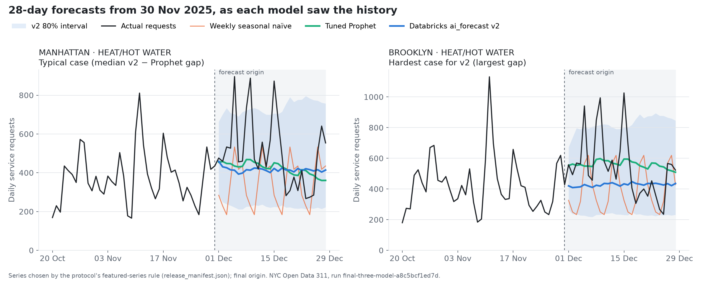
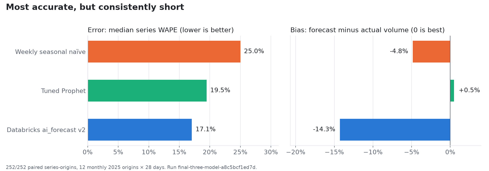
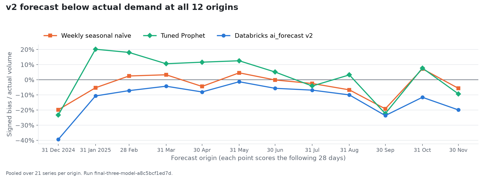
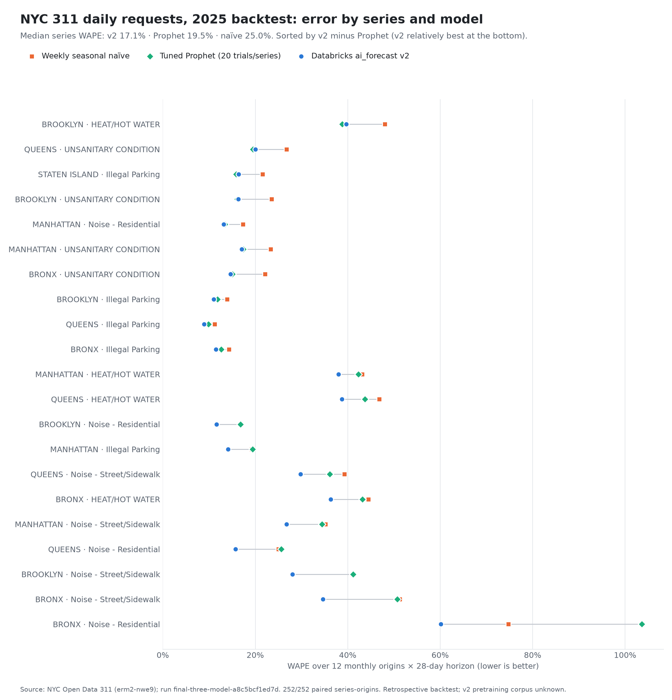
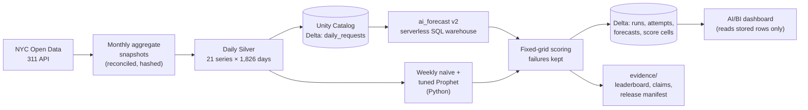

# Can one Databricks SQL function replace a forecasting pipeline?

[](https://github.com/soulipaco/databricks-forecast-planning-cockpit/actions/workflows/ci.yml)
[](LICENSE)
[](pyproject.toml)
[](evidence/freeze_manifest.json)
[](evidence/leaderboard.csv)

> A frozen-protocol benchmark of Databricks **`ai_forecast` v2** against a **tuned Prophet** pipeline and a **weekly seasonal baseline** on NYC 311 daily service requests. It covers 21 series, 12 monthly forecast origins in 2025 and a 28-day horizon, with every prediction stored in Delta and served through a code-managed AI/BI dashboard.

**The one-line SQL function was the most accurate model, and it still failed the test.** It had the lowest error on 17 of 21 series, but it forecast 14% less demand than actually arrived. The rule for "competitive" was written down before any 2025 data was downloaded, and it requires both accuracy and low bias.



*Above: the two heating series that the protocol's featured-series rule selects, forecast on 30 Nov 2025. The v2 forecast (blue) follows the level well, but in Brooklyn it sits under almost every cold-weather spike.*

## Result



| Model | Median series WAPE (primary) | Pooled WAPE | Signed bias | 80% interval coverage | Most accurate on |
|---|---|---|---|---|---|
| Weekly seasonal naïve | 25.0% | 32.4% | −4.8% | n/a | 0 / 21 series |
| Tuned Prophet (20 trials/series) | 19.5% | 34.2% | +0.5% | 77.7% | 4 / 21 |
| Databricks `ai_forecast` v2 | **17.1%** | **25.3%** | −14.3% | 77.9% | **17 / 21** |

- **Verdict under the pre-registered rule:** "practically competitive" means error no more than 5% worse than Prophet **and** absolute bias no more than 2 points worse. v2 is 12% better on error but 13.8 points worse on bias, so it does **not** qualify.
- **The shortfall is not one bad month.** v2 was below actual demand at every one of the 12 origins, most sharply in winter:



- **One series behaves like a different process.** Bronx residential-noise complaints jump to as much as eight times their usual monthly volume, for example about 52,000 in January 2025 against roughly 6,000 normally. That series produces Prophet's worst errors (above 100% WAPE) and dominates the volume-weighted figures. This is why the protocol ranks models by the *median* series.
- **Runtime is not like-for-like.** v2 took a median of 5.3 s per series-origin in a serverless SQL warehouse, and Prophet refits took 0.26 s locally, excluding the separate tuning. No monetary cost was measured.

<details>
<summary>Error for every series (21 × 3 models)</summary>



</details>

Every number above is recomputed three ways: the Python summary, SQL over the persisted Delta tables, and plain arithmetic on [`evidence/series_scores.csv`](evidence/series_scores.csv). See [`evidence/`](evidence/README.md).

## How the test was kept fair

1. **Series selection (2021–2023):** 21 borough × problem-family series chosen by fixed density rules ([data spec](docs/design/02_DATA_SPEC.md)).
2. **Prophet tuning (2024):** 20 Optuna trials per series, seed 42, scored on three 2024 inner origins.
3. **Development check (2024):** all three models were run at two origins to set a per-series champion policy.
4. **Freeze:** the protocol, config, series, tuning and development results were hash-locked ([`freeze_manifest.json`](evidence/freeze_manifest.json), tag `protocol-v1.0-frozen`). Three deviations were registered beforehand ([protocol](docs/design/03_BENCHMARK_PROTOCOL.md#registered-deviations-before-freeze)).
5. **2025 evaluation:** 2025 data was downloaded only after the freeze. Every stage re-checks the freeze hashes and refuses to run if a locked input changed.

Every model received exactly the last 1,095 days before each origin. The baseline repeats the last observed week. v2 queries carried unique tags, and query history confirmed that none of the 252 queries was served from the result cache.

## Architecture



| Stage | Code |
|---|---|
| Extraction and snapshots | `src/nyc311_forecast/ingest`, `src/nyc311_forecast/data` |
| Models | `src/nyc311_forecast/models`, `src/nyc311_forecast/platform/native_sql.py` |
| Scoring, freeze gate, final stages | `src/nyc311_forecast/evaluation`, `freeze.py`, `final_benchmark.py` |
| Delta and dashboard | `sql/`, `scripts/persist_final.py`, `dashboards/` |

Deployment is code-managed: a Databricks Asset Bundle ([`databricks.yml`](databricks.yml)) defines unscheduled, single-run serverless jobs. One of them reproduces the Silver payload byte-for-byte in the workspace.

## Running `ai_forecast` v2: what it actually needed

- **Free Edition:** the function fails while installing `onnxruntime`, because the SQL warehouse's isolated environment cannot reach PyPI, and the preview that enables that network access is not offered there ([decision record](docs/adr/native_v2_runtime_blocker.md)).
- **Trial or paid workspace:** it works once three things are in place:
  - the Predictive AI Functions preview is enabled;
  - *Enable networking for isolated workloads in Serverless SQL Warehouses* is enabled, followed by a warehouse restart;
  - a brand-new workspace has finished provisioning its system schemas (about an hour).
- **Horizon boundary:** v2 includes the `horizon` date, although the documentation calls it exclusive. The adapter requests exactly 28 days and fails on any other row count ([details](docs/adr/native_v2_horizon.md)).

## Repository layout

| Path | Contents |
|---|---|
| `src/nyc311_forecast/` | Ingestion, Silver, models, evaluation, freeze gate, final benchmark stages, Databricks adapters |
| `scripts/` | Workspace loads, Delta persistence with exact readback, dashboard deployment, release export, verification |
| `sql/` | Contract tables, serving views, headline leaderboard query |
| `dashboards/` | AI/BI dashboard definitions ([index](dashboards/README.md)) |
| `databricks.yml`, `resources/`, `jobs/` | Asset Bundle and job entry points |
| `data/` | Hashed source snapshots, series manifest, Silver payloads (aggregates only) |
| `evidence/` | Runs, scores, checks and release tables ([index](evidence/README.md)) |
| `docs/design/` | Protocol, data spec, contracts, operations and release gates |
| `docs/adr/` | Decision records |
| `tests/` | 85 tests: leakage, splits, metrics, contracts, retry policy, freeze gate, persistence |

## Reproduce

```bash
uv sync --all-extras
uv run pytest -q
uv run python -m nyc311_forecast.final_benchmark verify-freeze
```

The final run needs a Databricks workspace where v2 works, and a local, untracked config (for example `conf/trial.local.yaml`) with `workspace_host`, `workspace_profile`, `warehouse_id`, `catalog` and `schema`:

```bash
uv run --extra prophet python -m nyc311_forecast.final_benchmark local --output <local.json>
uv run --extra platform --extra prophet python -m nyc311_forecast.final_benchmark native --config conf/trial.local.yaml --output <native.json>
uv run python -m nyc311_forecast.final_benchmark combine --local <local.json> --native <native.json> --output <combined.json> --summary <summary.json>
uv run python scripts/verify_development_predictions.py --input <combined.json> --silver data/silver/evaluation-silver-20260929/daily_requests.jsonl --output <check.json>
```

In a three-repeat test, v2 produced identical outputs. Prophet's point forecasts were identical, but its interval bounds vary slightly because they are sampled.

## Limitations

- This is a retrospective backtest on a current snapshot of one public dataset, not a reconstruction of what was published at each origin.
- The v2 foundation model's training data is undisclosed and may include public NYC data.
- v2 ran in a Databricks trial workspace, while naïve and Prophet ran locally.
- The results cover 21 series and 12 origins, so they support no universal winner or equivalence claim.
- 311 service requests are not call-centre staffing; no capacity or savings claims are made.

## Credits

Data: [NYC Open Data, 311 Service Requests](https://data.cityofnewyork.us/Social-Services/311-Service-Requests-from-2010-to-Present/erm2-nwe9). This is an independent project with no NYC affiliation. The Prophet adapter reuses parts of [prophet-forecasting-mlops](https://github.com/soulipaco/prophet-forecasting-mlops) at commit `b2538be` ([adapter decision](docs/adr/prophet_adapter.md)). Git history was rewritten once to remove a private workspace host; the old-to-new commit map is in [`docs/history_rewrite.md`](docs/history_rewrite.md).

Code is released under the [MIT License](LICENSE); data attribution is in [NOTICE](NOTICE). Changes are listed in [CHANGELOG.md](CHANGELOG.md).
