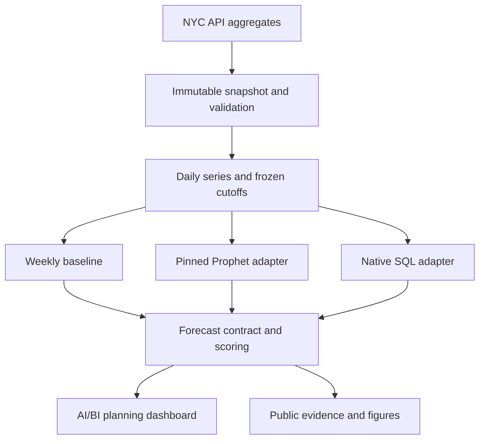

# Architecture and data contracts

## System boundaries



Shared work: ingest, validate, prepare, schedule, score, monitor and explain. Model-specific work: fit/tune or invoke managed inference. Measure these separately so the comparison cannot attribute the shared pipeline only to Prophet.

## Proposed repository layout

Keep the planning Markdown at root for this implementation. Add:

| Path | Responsibility |
|---|---|
| `src/nyc311_forecast/config.py` | Typed validated experiment and environment settings |
| `src/nyc311_forecast/ingest/` | API clients, pagination, manifests and snapshots |
| `src/nyc311_forecast/data/` | Normalization, alias map, spine and selection |
| `src/nyc311_forecast/models/` | `snaive.py`, `prophet_adapter.py`, `native_sql.py` |
| `src/nyc311_forecast/evaluation/` | Splits, metrics, coverage, pairing and policy selection |
| `src/nyc311_forecast/platform/` | Delta IO, SQL execution and experiment tracking |
| `src/nyc311_forecast/evidence/` | Deterministic tables, charts and claims export |
| `conf/` | Base, smoke, benchmark, dev and optional release overlays |
| `sql/` | Tables/views, source and native-forecast SQL templates |
| `resources/` | Bundle jobs and dashboard resource |
| `dashboards/` | Exported `.lvdash.json` and dataset queries |
| `scripts/` | Thin job entry points and local command wrappers |
| `tests/` | Unit, contract and opt-in workspace integration tests |
| `evidence/` | Small release tables, checksums, manifests and charts |
| `portfolio/` | Figures generated from stored results, and their scripts. Launch copy and campaign material are kept outside this repository. |
| `docs/adr/` | Decisions and protocol amendments |
| `.github/workflows/` | Local checks; optional authorized deployment workflow |

Use one package, not a framework with plug-ins and a service layer. Python 3.12 is the initial local target; verify the workspace environment and dependency compatibility. Resolve and commit a lockfile. Use optional extras for Prophet, platform access and visualization. Pin the upstream Prophet commit rather than following `main`.

## Adapter interface

Proposed Python protocol to implement, not an existing API:

```python
def forecast(history, future_dates, *, series_id, origin,
             model_config, execution_context) -> ForecastResult:
    ...
```

`history` contains sorted `ds: date`, `y: float` and optional approved covariates; all dates ≤ origin. `future_dates` is exactly origin+1 through origin+28. `ForecastResult` contains a typed prediction frame, timing/lineage and status. Keep platform calls in the native adapter. Scoring must accept each model's normalized outputs without model-specific branches.

The orchestrator loops origin/model batches, not individual dashboard interactions. Native SQL may submit multiple independent series in one call; maintain series-level accounting even when the batch fails. Do not assume grouping shares learned information across series.

## Contract v1

Use a configurable `${catalog}.${schema}` with names below. DATE fields stay DATE. Timestamps for run events are UTC; source civil dates remain unchanged.

| Table | Unique grain | Required content |
|---|---|---|
| `source_partitions` | snapshot_id, partition_id | endpoint, query_hash, extracted_at, payload_hash, aggregate_rows, source_count, grouped_count, status |
| `daily_requests` | snapshot_id, series_id, ds | borough, problem_family, y BIGINT, is_zero_filled BOOLEAN, quality_status, mapping_version |
| `series_manifest` | experiment_id, series_id | selection rank, inclusion status/reason, development counts, mapping hash |
| `forecast_runs` | run_id | experiment_id, snapshot_id, protocol_hash, config_hash, code_sha, upstream_sha, environment, start/end, status |
| `forecast_attempts` | run_id, model_id, origin, series_id, attempt_no | status, error_class, safe_error_message, query_id, queue_seconds, compute_seconds, wall_seconds, retry_reason |
| `forecast_values` | run_id, model_id, origin, series_id, ds | lead_day, prediction DOUBLE, lower/upper nullable DOUBLE, interval_level nullable, raw values, transform flags, is_fallback BOOLEAN |
| `evaluation_cells` | run_id, model_id, origin, series_id, horizon_days | n_expected, n_actual, n_predictions, paired status, abs_error_sum, actual_sum, signed_error_sum, MASE denominator, interval counts/width/score |
| `champion_policy` | policy_id, series_id | selected_model_id, selected_on_data_through, development_run_id, reason, tolerance_config_hash |
| `capacity_assumptions` | scenario_id, series_id, ds | capacity_requests DOUBLE, assumption_source, is_illustrative BOOLEAN, version |
| `release_claims` | release_id, claim_id | text, source_artifact, calculation_reference, evidence_run_id, review_status |

Keys for forecasts identify a prediction *vintage*. Never join actuals and forecasts on date/series alone when multiple origins or runs exist. Scoring joins actuals on snapshot/series/date and preserves forecast run/model/origin. Dashboard views require an explicit run and origin or a documented latest-valid-vintage rule.

## Storage and idempotency

Create an immutable logical `run_id` for one code/config/snapshot/protocol combination plus a declared execution identifier. Keep attempts append-only. A retry must not create duplicate prediction keys. Publish validated outputs by a transactional Delta MERGE or staged replacement scoped to the run/model/origin/series keys. Do not delete a whole table and reappend it.

Completed release runs are immutable. Corrected runs get new IDs and a `supersedes_run_id` reference. Store the manifest before launch and final status after all expected tasks are accounted for. Partial runs may be inspected but must not appear as successful latest runs.

## Semantic views

- `v_model_leaderboard`: ratio-of-sums metrics and separate macro measures, with paired denominators.
- `v_forecast_detail`: actuals, predictions and intervals for one selected vintage.
- `v_planning_gap`: demand minus assumed capacity, linked to the frozen champion policy.
- `v_data_quality`: source freshness, missing partitions, zero-fill and excluded counts.
- `v_run_health`: attempts, failures, duration and optional measured cost.

Avoid summing interval endpoints across independent series and describing the result as an 80% aggregate interval. For total uncertainty, fit a separate total series or implement a dependence-aware simulation later. Sum point forecasts for descriptive totals only and label the unreconciled hierarchy.

## Reuse of existing Prophet project

The public repository documents model/tuning code, batch contracts and bundle deployment, while listing several operational capabilities as outside its implemented scope. Treat it as reusable engineering work, not proof that every production feature already exists. [Existing repository](https://github.com/soulipaco/prophet-forecasting-mlops)

Create a short adapter decision record: selected commit; actual callable imports; license/attribution; removed assumptions; required wrapper changes; a parity test on a small seven-day-calendar fixture. Prefer importing the pinned package. If its public API cannot support this protocol, isolate a minimal attributed adaptation and explain why. Never copy the whole project by default.
